---
## Author
author:
  name: Жаворонков Кирилл Александрович

## Title
title: "Лабораторная работа"
subtitle: "Номер 1"
license: "CC BY"
---

# Цель работы

Основной целью работы является установка и настройка языка программирования Julia и среды интерактивной разработки JupyterLab, а также изучение базовых конструкций языка Julia: типов данных, преобразования типов, функций, векторов, матриц и операций над ними.

# Выполнение лабораторной работы

## 1. Установка Julia

Для выполнения лабораторной работы использовалась операционная система Windows. Установка Julia выполнялась с помощью менеджера пакетов Chocolatey. В командной строке была введена команда:

```powershell
choco install julia -y
```

В результате была установлена Julia версии 1.12.0. Установщик сообщил об успешном завершении установки и разместил исполняемый файл Julia в каталоге пользователя (рис. [-@fig-001]).

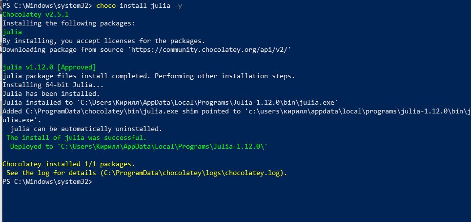{#fig-001}

## 2. Запуск Julia и проверка работы REPL

После установки Julia была запущена в режиме REPL. В открывшемся окне отображается версия Julia 1.12.0. Для проверки выполнения программного кода было вычислено выражение:

```julia
2 + 2
```

Результат выполнения равен `4`, что подтверждает корректную установку и запуск Julia (рис. [-@fig-002]).

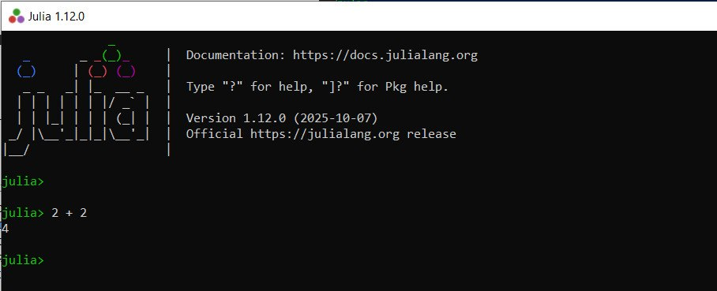{#fig-002}

## 3. Работа в JupyterLab и справочная система Julia

В JupyterLab был создан ноутбук с ядром Julia. В первой ячейке выполнено простое выражение:

```julia
2 + 3
```

Результат выполнения равен `5`.

Также была проверена встроенная справочная система Julia. Для получения информации о функции `println` перед её именем был установлен знак вопроса:

```julia
?println
```

Jupyter вывел описание функции, её сигнатуру и пример использования (рис. [-@fig-003]).

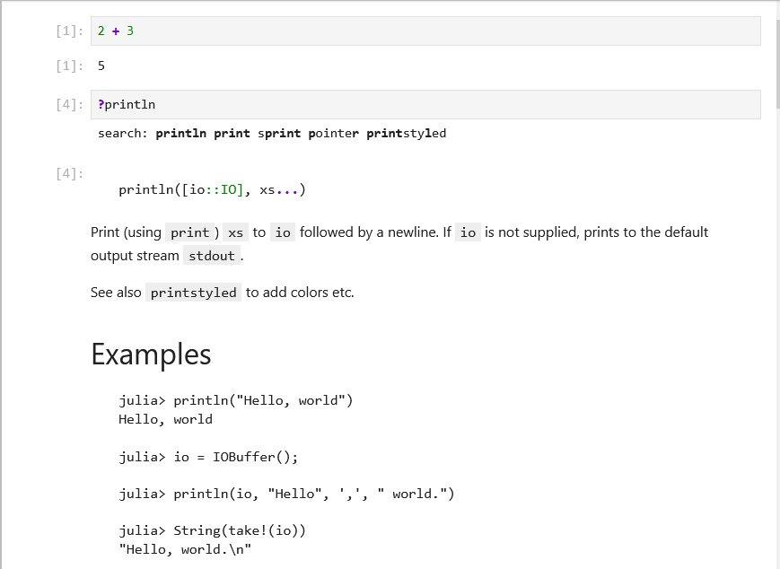{#fig-003}

## 4. Определение типов числовых величин

Для определения типа числовых значений была использована функция `typeof()`:

```julia
typeof(3)
```

Результатом является тип `Int64`.

Дополнительно были исследованы типы вещественного, комплексного и иррационального чисел:

```julia
typeof(3.5), typeof(3 / 3.5), typeof(sqrt(3 + 4im)), typeof(pi)
```

В результате были получены типы `Float64`, `Float64`, `ComplexF64` и `Irrational`. Также были рассмотрены специальные значения, возникающие при делении на ноль:

```julia
1.0 / 0.0
1.0 / (-0.0)
```

Результатами являются `Inf` и `-Inf` (рис. [-@fig-004]).

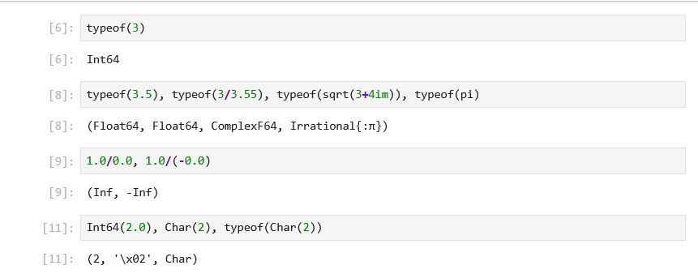{#fig-004}

В той же работе были проверены преобразования типов:

```julia
Int64(2.0), Char(2), typeof(Char(2))
```

Число `2.0` было преобразовано в `Int64`, а число `2` — в символ. В Julia символ отображается в виде специальной записи, соответствующей коду символа.

## 5. Определение функций

Функция возведения числа в квадрат была определена с помощью конструкции `function ... end`:

```julia
function f(x)
    x^2
end

println(f(4))
```

Результатом является число `16`. После этого функция была вызвана повторно:

```julia
f(4)
```

Результат также равен `16` (рис. [-@fig-005]).

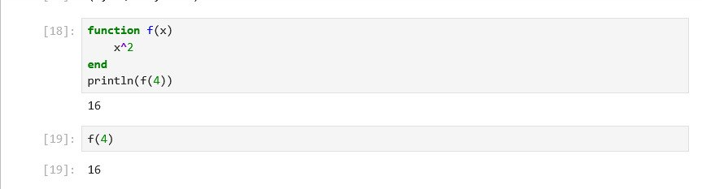{#fig-005}

## 6. Векторы и матрицы

Были созданы вектор-строка и вектор-столбец:

```julia
a = [4 7 6]
b = [1, 2, 3]

a[2], b[2]
```

Результатом является кортеж `(7, 2)`, поскольку индексация в Julia начинается с единицы, а вторые элементы векторов равны `7` и `2`.

Затем была создана матрица:

```julia
a = 1; b = 2; c = 3; d = 4;
Am = [a b; c d]
```

Получена матрица размера `2×2`:

```text
1  2
3  4
```

Также были выполнены операции над массивами:

```julia
aa = [1 2]
AA = [1 2; 3 4]
aa * AA * aa'
```

Результатом матричного выражения является матрица размера `1×1` со значением `27`. Символ `'` используется для транспонирования (рис. [-@fig-006]).

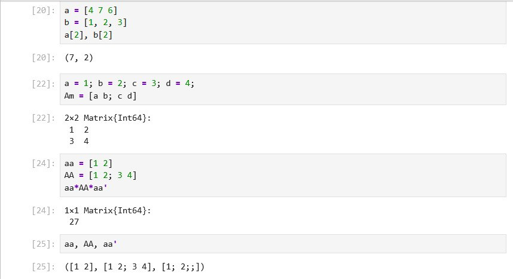{#fig-006}

# Самостоятельная работа

## 7. Функции вывода информации

Для изучения функций вывода были использованы `print()` и `println()`:

```julia
print("1")
print("2")
```

Результат имеет вид `12`, поскольку `print()` не добавляет перевод строки.

При использовании `println()`:

```julia
println("1")
println("2")
```

каждое значение выводится с новой строки. Таким образом, `println()` автоматически добавляет перевод строки после вывода (рис. [-@fig-007]).

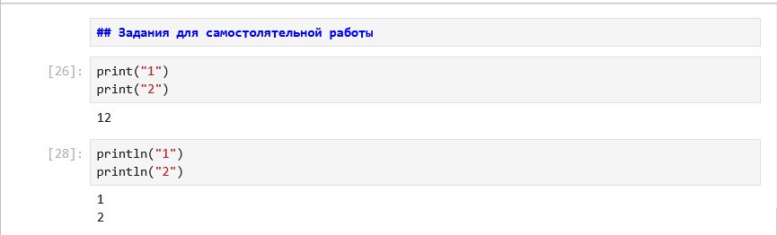{#fig-007}

## 8. Функции show(), readline() и readlines()

Функция `show()` была проверена на векторе:

```julia
show([1, 2, 3])
println()
```

Она вывела текстовое представление объекта `[1, 2, 3]`.

Для чтения одной строки использовалась функция `readline()`:

```julia
name = readline()
println(name)
```

В ячейку был введён текст, после чего он был выведен на экран.

Также была проверена функция `readlines()`:

```julia
lines = readlines()
println(length(lines))
```

В данном запуске было считано нулевое количество строк, поэтому результатом `length(lines)` стало значение `0` (рис. [-@fig-008]).

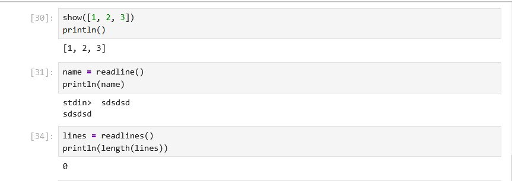{#fig-008}

## 9. Запись и чтение текстового файла

Для записи данных в файл была использована функция `write()`:

```julia
write("12.txt", "123123")
```

Функция вернула число `6`, то есть количество записанных символов.

Для чтения файла применена функция `read()` с указанием типа результата `String`:

```julia
text = read("12.txt", String)
println(text)
```

На экран было выведено содержимое файла `123123` (рис. [-@fig-009]).

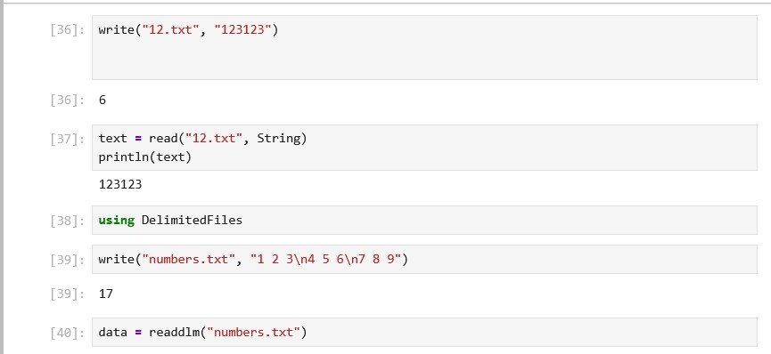{#fig-009}

## 10. Чтение табличных данных с помощью readdlm()

Для работы с функцией `readdlm()` был подключён модуль `DelimitedFiles`:

```julia
using DelimitedFiles
```

Затем был создан текстовый файл с табличными данными:

```julia
write("numbers.txt", "1 2 3\n4 5 6\n7 8 9")
```

Файл был прочитан командой:

```julia
data = readdlm("numbers.txt")
println(data)
```

В результате была получена матрица размера `3×3`, содержащая числа от 1 до 9 (рис. [-@fig-010]).

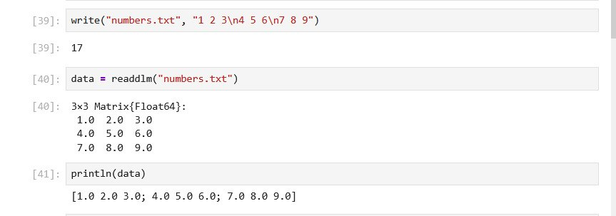{#fig-010}

## 11. Логические операции и целочисленное деление

Были заданы логические переменные:

```julia
p = true
q = false
```

Затем выполнены логические операции:

```julia
println(p && q)
println(p || q)
println(!p)
```

Результаты показали работу логических операторов `&&`, `||` и `!`.

Также были проверены функции и операторы целочисленного деления:

```julia
println(div(10, 3))
println(10 % 3)
```

Функция `div(10, 3)` возвращает целую часть частного — `3`, а оператор `%` возвращает остаток от деления — `1` (рис. [-@fig-011]).

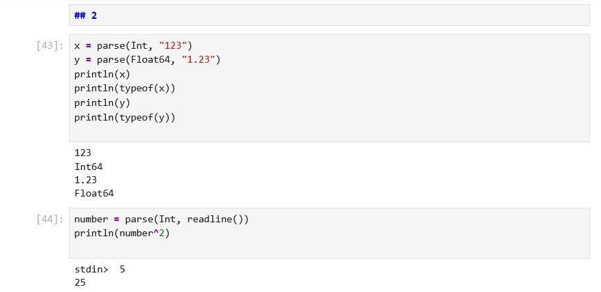{#fig-011}

## 12. Операции над векторами

Были созданы два вектора:

```julia
v1 = [1, 2, 3]
v2 = [4, 5, 6]
```

Над ними выполнены следующие операции:

```julia
println(v1 + v2)
println(v1 - v2)
println(v1 * 2)
```

Получены результаты:

```text
[5, 7, 9]
[-3, -3, -3]
[2, 4, 6]
```

Таким образом, Julia поддерживает сложение и вычитание векторов одинакового размера, а также умножение вектора на скаляр (рис. [-@fig-012]).

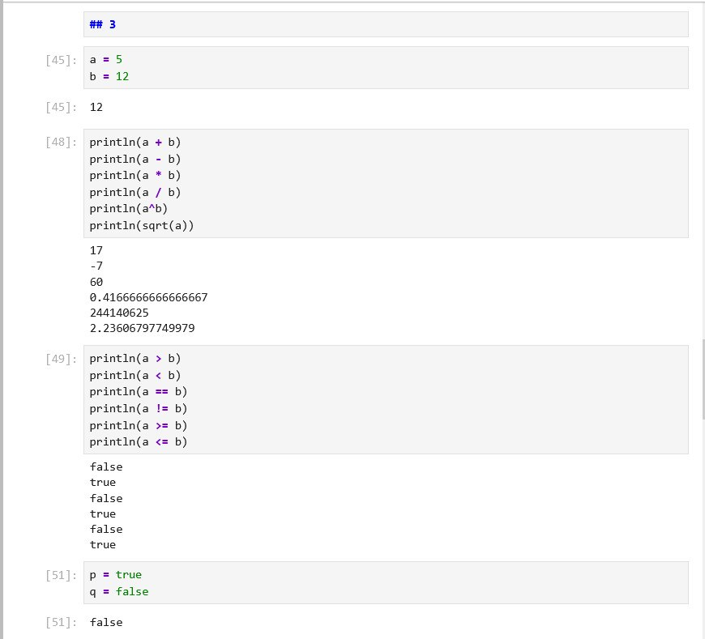{#fig-012}

## 13. Скалярное произведение и транспонирование

Для выполнения операций линейной алгебры был подключён модуль `LinearAlgebra`:

```julia
using LinearAlgebra
```

Скалярное произведение вычислено командой:

```julia
println(dot(v1, v2))
```

Результат равен `32`:

```text
1 · 4 + 2 · 5 + 3 · 6 = 32
```

Также было выполнено транспонирование:

```julia
println(v1')
```

Первоначально при вызове `dot(v1, v2)` возникла ошибка `UndefVarError: dot not defined in Main`. Она была исправлена подключением модуля `LinearAlgebra`, после чего функция `dot()` стала доступна (рис. [-@fig-013]).

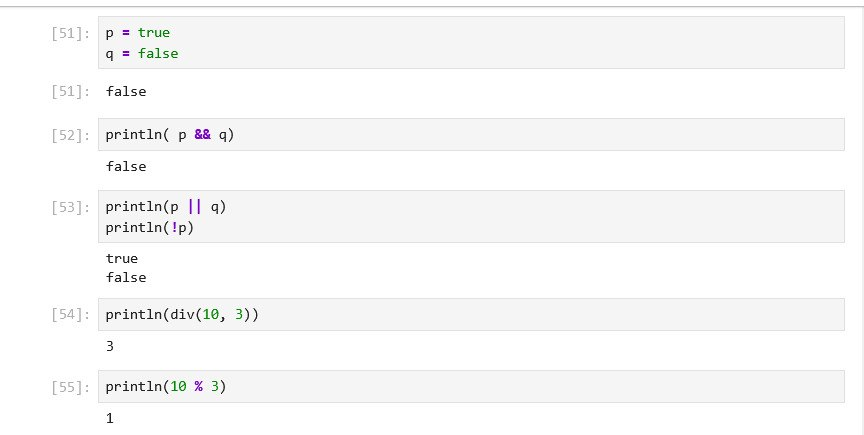{#fig-013}

## 14. Операции над матрицами

Были заданы матрицы:

```julia
A = [1 2; 3 4]
B = [5 6; 7 8]
```

Затем выполнены сложение, вычитание, матричное умножение, умножение на скаляр и транспонирование:

```julia
println(A + B)
println(A - B)
println(A * B)
println(2 * A)
println(A')
```

Результаты:

```text
A + B = [6 8; 10 12]
A - B = [-4 -4; -4 -4]
A * B = [19 22; 43 50]
2 * A = [2 4; 6 8]
A' = [1 3; 2 4]
```

Также была продемонстрирована разница между матричным и поэлементным умножением:

```julia
println(A * B)
println(A .* B)
println(A .^ 2)
```

Оператор `*` выполняет матричное умножение, `.*` — поэлементное умножение, а `.^` — поэлементное возведение в степень (рис. [-@fig-014]).

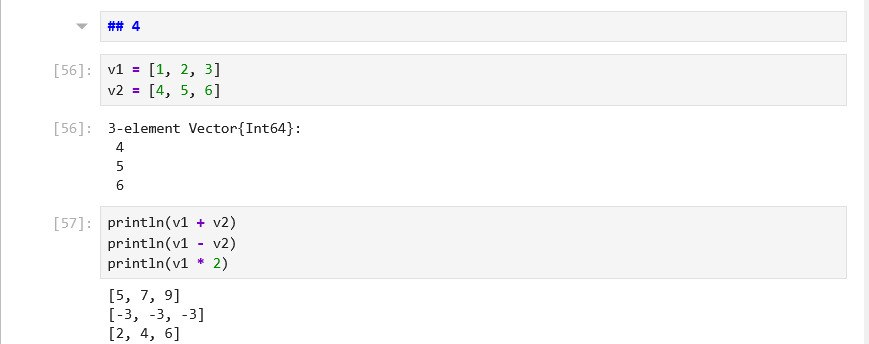{#fig-014}

## 15. Функция parse()

Функция `parse()` используется для преобразования строкового представления значения в объект указанного типа:

```julia
x = parse(Int, "123")
y = parse(Float64, "1.23")

println(x)
println(typeof(x))
println(y)
println(typeof(y))
```

В результате строка `"123"` была преобразована в значение типа `Int64`, а строка `"1.23"` — в значение типа `Float64`.

Также была выполнена совместная работа `parse()` и `readline()`:

```julia
number = parse(Int, readline())
println(number^2)
```

При вводе числа `5` программа вывела результат `25` (рис. [-@fig-015]).

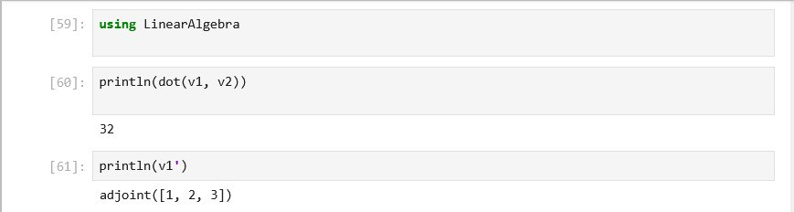{#fig-015}

## 16. Арифметические операции и сравнение

Были заданы переменные:

```julia
a = 5
b = 12
```

Выполнены основные арифметические операции:

```julia
println(a + b)
println(a - b)
println(a * b)
println(a / b)
println(a^b)
println(sqrt(a))
```

Результаты включают сумму `17`, разность `-7`, произведение `60`, частное `0.4166666666666667`, значение `a^b` и квадратный корень из `a`.

Затем были выполнены операции сравнения:

```julia
println(a > b)
println(a < b)
println(a == b)
println(a != b)
println(a >= b)
println(a <= b)
```

Результаты имеют логический тип и принимают значения `true` или `false` (рис. [-@fig-016]).

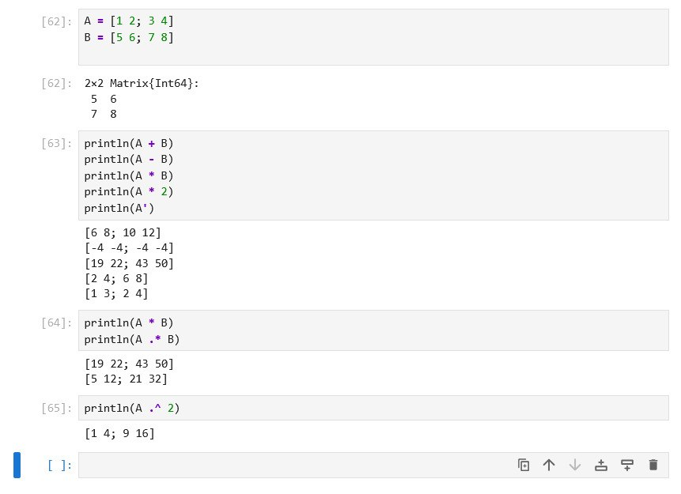{#fig-016}

# Выводы

В ходе лабораторной работы была установлена и настроена среда программирования Julia в операционной системе Windows. Julia была установлена с помощью Chocolatey, после чего была проверена её работа в режиме REPL. Для интерактивного выполнения программ использовался JupyterLab с ядром Julia.

В процессе выполнения работы были изучены функция `typeof()` для определения типов данных, специальные значения `Inf` и `-Inf`, преобразования типов, определение функций, создание векторов и матриц, а также обращение к элементам массивов.

В самостоятельной части были рассмотрены функции `print()`, `println()`, `show()`, `readline()`, `readlines()`, `read()`, `write()` и `readdlm()`. С помощью `parse()` были выполнены преобразования строк в целые и вещественные числа.

Также были выполнены арифметические, логические и матричные операции, включая сложение, вычитание, умножение, деление, возведение в степень, извлечение корня, сравнение, транспонирование, поэлементные операции и скалярное произведение. Возникшая ошибка при использовании `dot()` была исправлена подключением модуля `LinearAlgebra`.
