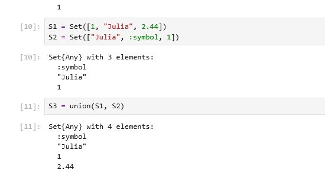
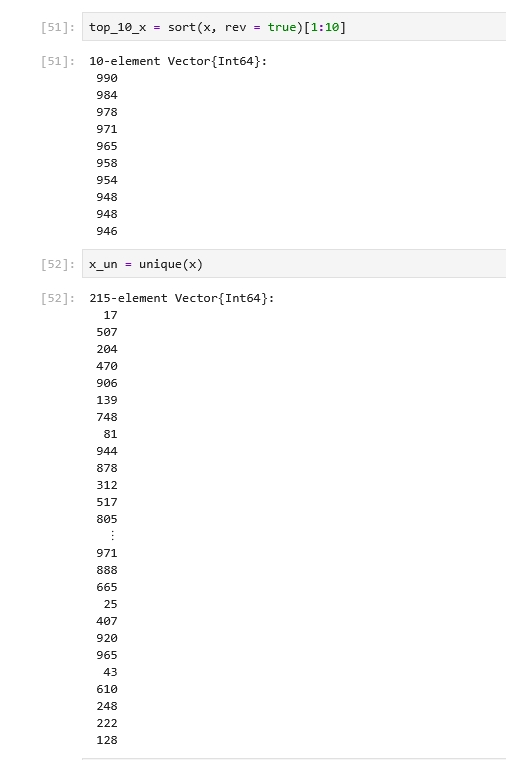
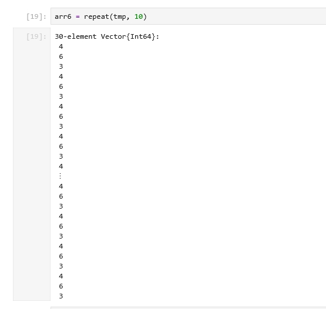
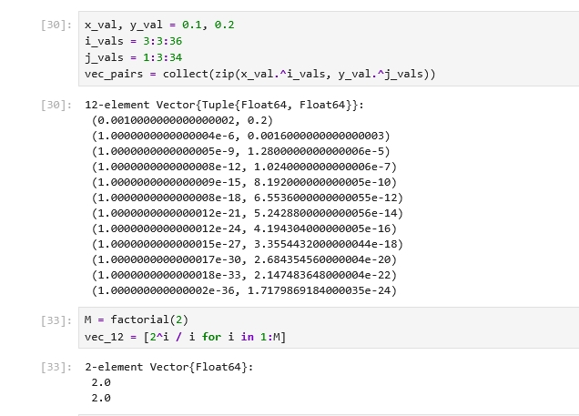
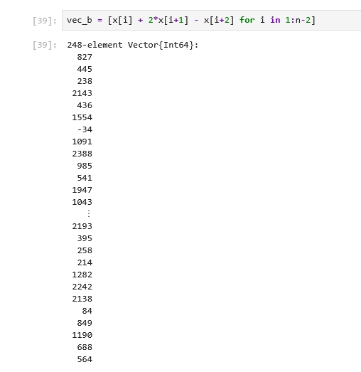
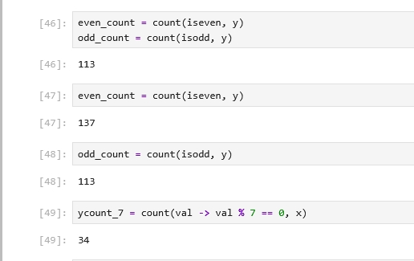
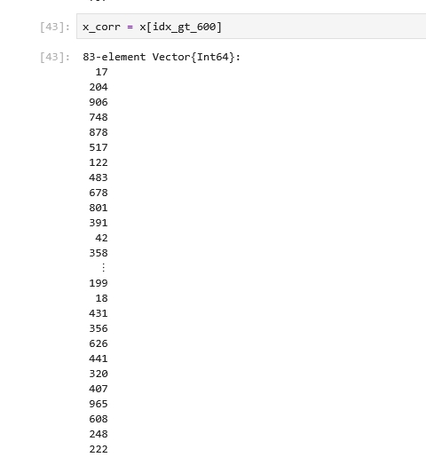
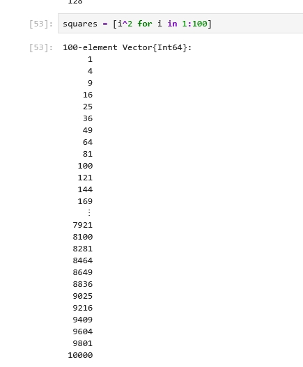
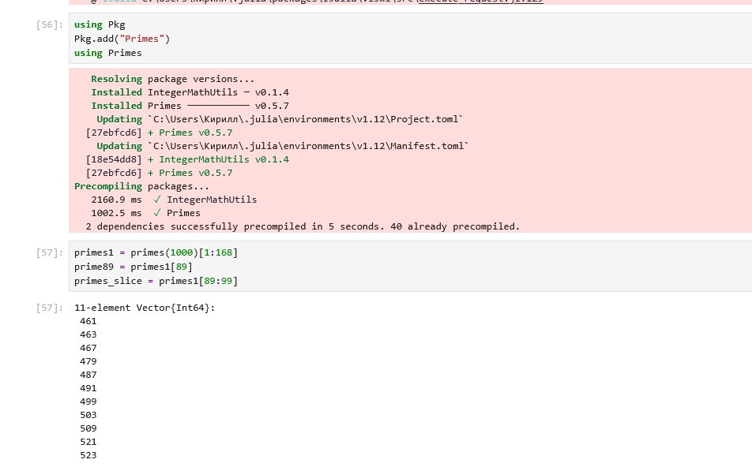
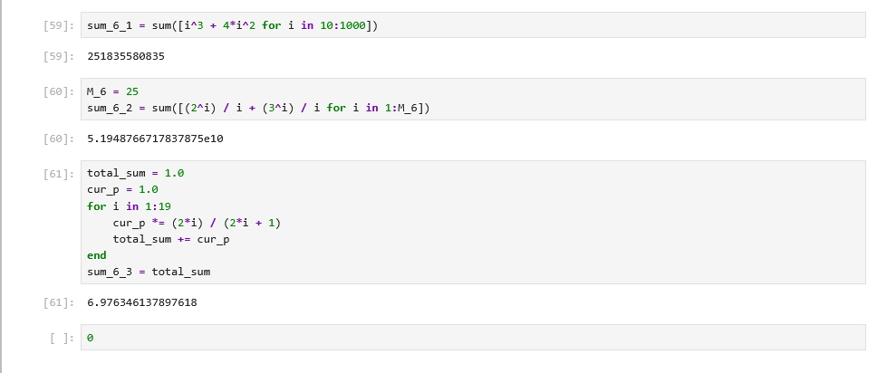

---
author:
  name: Жаворонков Кирилл Александрович
title: "Лабораторная работа № 2"
subtitle: "Структуры данных в Julia"
license: CC BY
date: today
date-format: "YYYY-MM-DD"
lang: ru-RU
format:
  pptx:
    toc: false
---

# Докладчик

* Жаворонков Кирилл Александрович
* Студент
* Группа: НПИбд-01-23
* Номер студенческого билета: 1132231844

# Цель работы

* Изучить структуры данных Julia: множества, кортежи, словари, векторы и матрицы.
* Освоить создание и преобразование массивов.
* Научиться применять фильтрацию, сортировку, статистические функции и пакет Primes.

# Слайд 1. Множества

* Созданы множества A, B и C.
* Выполнено объединение попарных пересечений.
* Получено P = {0, 1, 3, 4, 7, 9}; |P| = 6.

{height=55%}

# Слайд 2. Диапазоны и фильтрация

* Создан массив чисел от 1 до 25.
* С помощью filter выбраны элементы, большие 20: [21, 22, 23, 24, 25].
* Рассмотрены прямой и обратный диапазоны.

{height=55%}

# Слайд 3. Повторение элементов

* Использованы fill, repeat и vcat.
* repeat(tmp, 10) повторяет весь вектор.
* fill(value, n) повторяет один элемент заданное число раз.

{height=55%}

# Слайд 4. Генераторы и zip

* Созданы векторы степенных выражений и строк fn1 … fn30.
* С помощью zip сформирован вектор из 12 кортежей.
* Генераторы позволяют компактно задавать вычисления.

{height=55%}

# Слайд 5. Операции над массивами

* Сформированы случайные массивы x и y длиной 250 элементов.
* Вычислены разности соседних элементов и линейные комбинации.
* Также применены тригонометрические функции поэлементно.

{height=55%}

# Слайд 6. Фильтрация и подсчёт

* Использованы findall, count, maximum и unique.
* Для одного запуска: элементов y > 600 — 83; чётных — 137; нечётных — 113.
* Количество элементов x, кратных 7, — 34.

{height=55%}

# Слайд 7. Сортировка

* sortperm позволяет упорядочить x по значениям y.
* sort(x, rev=true) возвращает элементы x в порядке убывания.
* unique удаляет повторяющиеся значения.

{height=55%}

# Слайд 8. Квадраты и простые числа

* Построены квадраты чисел от 1 до 100.
* Последние значения: 9604, 9801, 10000.
* В диапазоне до 1000 найдено 168 простых чисел.

{height=55%}

# Слайд 9. Пакет Primes

* 89-е простое число равно 461.
* Срез простых чисел с 89-го по 99-е: [461, 463, 467, 479, 487, 491, 499, 503, 509, 521, 523].
* Для вычислений подключён пакет Primes.

{height=55%}

# Слайд 10. Вычисление сумм

* Вычислены три суммы из задания.
* sum_6_1 = 251835580835.
* sum_6_2 ≈ 5.1948766717837875e10.
* sum_6_3 ≈ 6.976346137897618.

{height=55%}

# Выводы

* Изучены основные структуры данных Julia и операции над ними.
* Освоены генераторы, фильтрация, сортировка и статистическая обработка массивов.
* Получены практические навыки работы с пакетом Primes.
* При работе с большими произведениями учтена возможность переполнения Int64.
